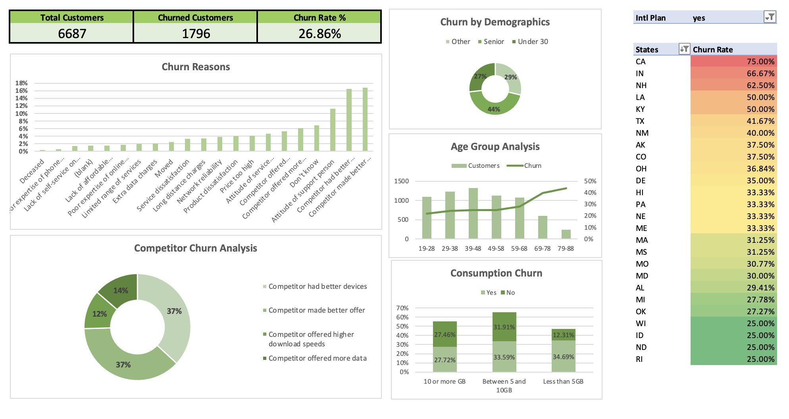

# Customer Churn Analysis Dashboard (Excel)

This project demonstrates an **interactive Excel dashboard** built to analyze customer churn using real-world styled data. The goal was to identify key churn drivers and provide actionable insights for reducing customer attrition

## Project Overview
Customer churn (the percentage of customers who stop using a product or service over a given time period) is a critical business metric.  
In this project, I designed and developed an **end-to-end Excel dashboard** that enables stakeholders to track churn rate, analyze churn by demographics, and understand reasons behind customer loss.

## Key Steps
- **Data Cleaning & Transformation**  
  Converted raw data into analysis-ready format for accurate reporting.  
- **Calculated Columns & KPIs**  
  Created churn-related metrics (churn rate, churn by demographics, competitor analysis, etc.).  
- **Trend & Segment Analysis**  
  Used **PivotTables and charts** to analyze churn across age groups, states, usage levels, and reasons for churn.  
- **Interactive Dashboard**  
  Designed a dashboard with **slicers, conditional formatting, and charts** for better storytelling.  
- **Actionable Insights**  
  Delivered findings to highlight **high-risk customer groups and churn drivers**.
  
## Tools & Skills
- **Microsoft Excel**  
- PivotTables & Charts  
- KPI & Dashboard Metrics  
- Data Cleaning & Transformation  
- Data Visualization & Storytelling  
- Strategic Data Analysis  

## Business Impact
The dashboard provides a clear view of churn trends and customer behavior, enabling businesses to:
- Identify **high-risk customers** before they leave.  
- Understand **key demographic groups** driving churn.  
- Support **data-driven decision-making** for customer retention strategies.  

## Dashboard Preview

